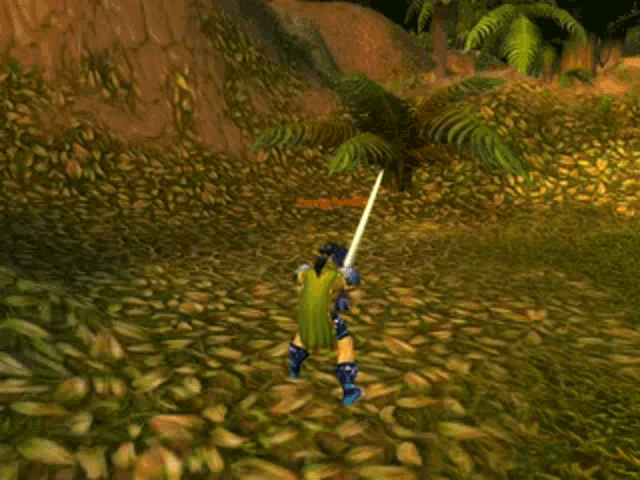

[Main page](../../../readme.md)

# Counters
Counter can represent score, level or currency.
It is used for keeping track of player progress, level progress or amount of currency held.  
Platformer game would use score as number of stars collected.  
Zombie game could represent the amount of zombies killed.  
Strategy game would represent amount of gold we have extracted.  
RPG game, level would show how much skill have we gained by progressing in the game.

***World of warcraft level up***\

## Lifetime
It is important to know the lifetime of a counter.

- **Mini game/mission**, means it will reset whenever a mini game is triggered.
- **Level**, means it will reset whenever another level loads.
- **Game**, means it will reset whenever we quit the game.
- **Save slot**, means it will reset whenever we create a new save slot.

## Owners
It is good to know who that counter belongs to.

- **player**, obviously most common location would be our player
- **Other players**, in a multiplayer game we want to know score of our friends.
- **NPCs**, when we want to loot an NPC we need to know their amount of currency.
- **Inventory**, we can store currency inside chests or inventories as well.

## Modifiers
The game needs to be able to modify the counter during certain game events.

- **Add**, during game we need to add the counter whenever player collects a star or kills a zombie. 
- **Subtract**, during game we want to remove some counter progress, we can do it as a form of punishment or we can use it as consumable. Spending our counter as currency for exchanging goods or power-ups.
- **Multiply**, special bonus in our game can double or triple our existing score.
- **Divide**, our counter can also represent a negative effect, so diving its value would decrease that effect.

## Listeners
We often need to present score or currency to the player to inform about our progress.
If we collect stars and do not see that a counter has increased the player does not understand that we keep track of it.

- **UI**, most common reader is the user interface where we present how much has score increased or decreased during gameplay.
- **Trigger**, can open doors for example when the counter has reached certain value.
- **Merchant**, NPCs in games can trade goods with us, but without keeping track of currency we could be buying their entire inventory in just few seconds. 

## Counter

 
