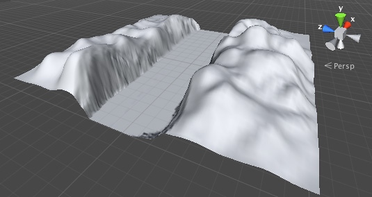
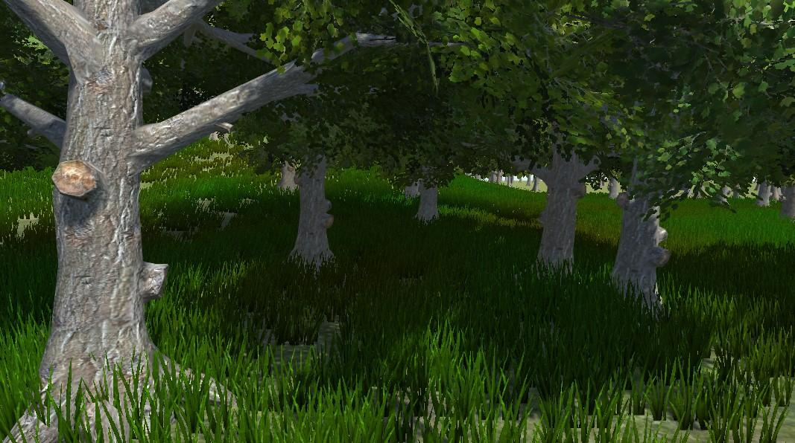
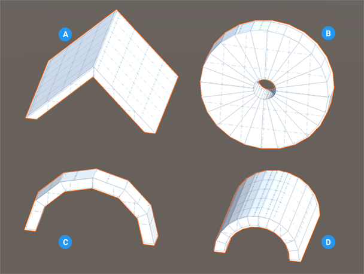

[World](world.md)

# World design

For designing our worlds we can use following tools:

### Unity Terrain editor
[Unity Terrain Docs](https://docs.unity3d.com/Manual/script-Terrain.html)  
For creating our base terrain.

***Valleys and Hills***  

Scattering tools for adding trees, bushes, houses.

***Trees***  

### Unity Probuilder
[Unity Probuilder Docs](https://docs.unity3d.com/Manual/com.unity.probuilder.html)  
It is polygonal modelling tool directly in Unity.
We can also use Blender and keep the source files in the Unity project
as unity can easily work with them directly.

***Arch***  

***Stairs***  

***Door***  

### Blender
[Blender](https://www.blender.org/)  
Blender can be used instead of probuilder, but the designer has to be aware of the needs of the game engine.
If we would just create a wonderfull world inside blender and import it into Unity it would probably look
nothing like it should in Unity and it would probably not even run smoothly. The game might be stuttering
as blender does not understand the optimizations needed for the environment to be playable inside Unity.
Therefore we use Blender mostly for modelling props. 