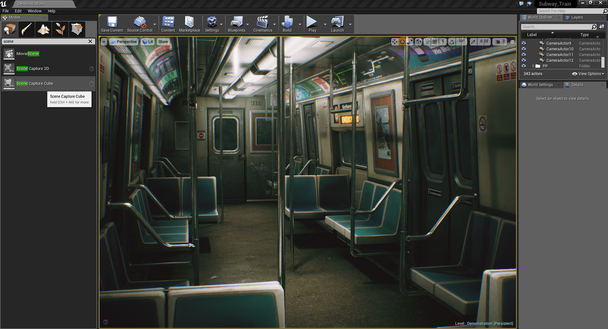
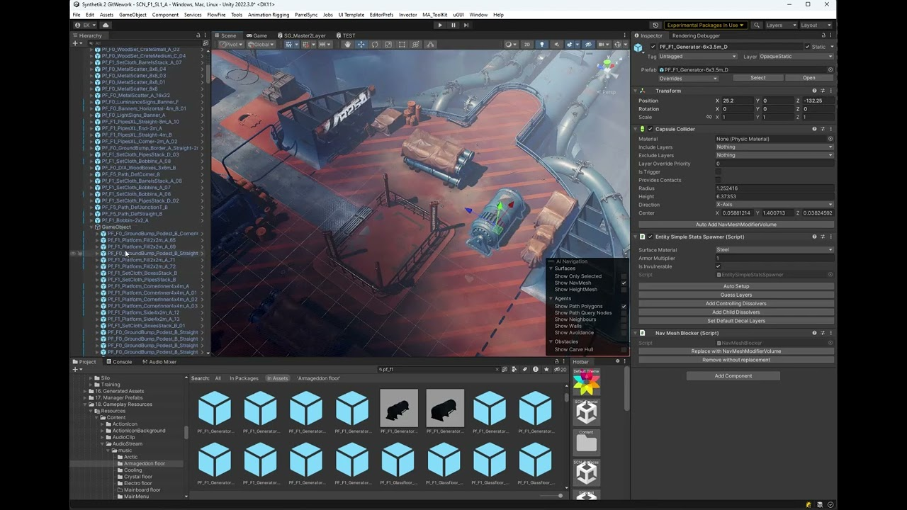

[Main page](../../../readme.md)

# Game engines

The purpose of game engine is to make game developers life simpler.  
It is a collection of tools which increase productivity.  
In the past the only game engine available was the one you had to write your self.  
Today we have many game engines available. While there are many debates about which
engine is the best, it always depends on the task.  

- Some games need great terrain editor and hyper realistic visuals.
- Some games need custom rendering pipeline, custom asset pipelines and don't have the time to build a custom engine
- Some games want a simple engine and prefer open source.

***Unreal Engine***\

***Unity3D***\

***Godot***\

There is not a perfect engine for every task. So having multiple engines is always great for developers.
However, every engine is made of specific parts which have similar function across all engines.
Those parts are:

- Asset management: importing 3D models, materials, textures, sprites, animations, sounds, movie clips.
- Physics: colliders, collision detection, rigid bodies, triggers, joints, cloth, ragdolls.
- Scene/Level: scene graph for placing 3D models, cameras, lights, sounds, sprites, scripts, colliders.
- Terrain: tools for creating rich virtual worlds, object scattering, terrain painting.
- Scripting: node based or textual.
- Animation: importing animations, skeletal animation, animation playback, animation state machines.
- Rendering: render pipeline, cameras, lights, materials, meshes, shaders.
- Sound: sound playback, sound mixer, sound effects.
- User Interface: layout engine, sprite renderer, text engine, event system.
- Input system: keyboard, game-pad, vr-ar controllers, midi controllers.
- AI: path-finding, state machines, decision trees.
- Multiplayer: matchmaking, server-client.
- Asset store: gamedev premade assets and projects.
- Build/Deployment: Windows, Mac, Play Station, Xbox, Nintendo Switch, iOS, Android, Meta Quest.

The decision of which engine to choose usually depends on the fidelity of those individual parts.

There are also custom engines made by AAA game developers.
- Rockstar: RAGE
- Electronic Arts: Frostbite
- Ubisoft: Anvil, Disrupt, Snowdrop, Lead, Dunia
- Crytek: CryEngine
- Konami: Fox Engine
- CD Projekt: Red engine

[list of engines](https://gist.github.com/raysan5/909dc6cf33ed40223eb0dfe625c0de74)