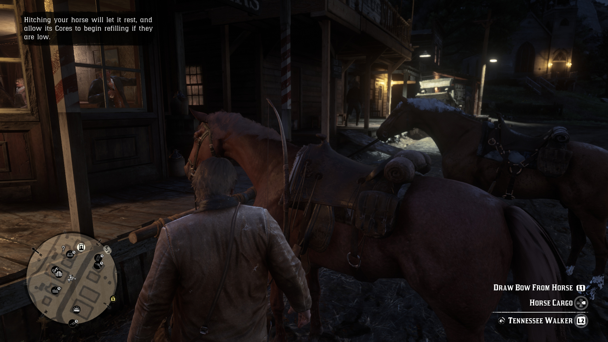
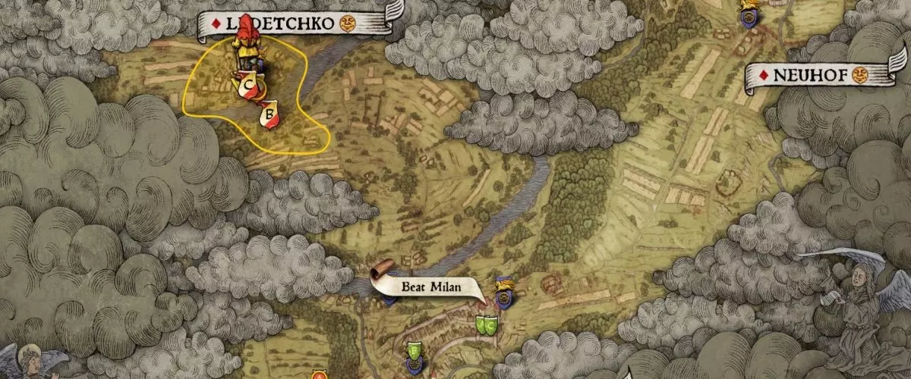
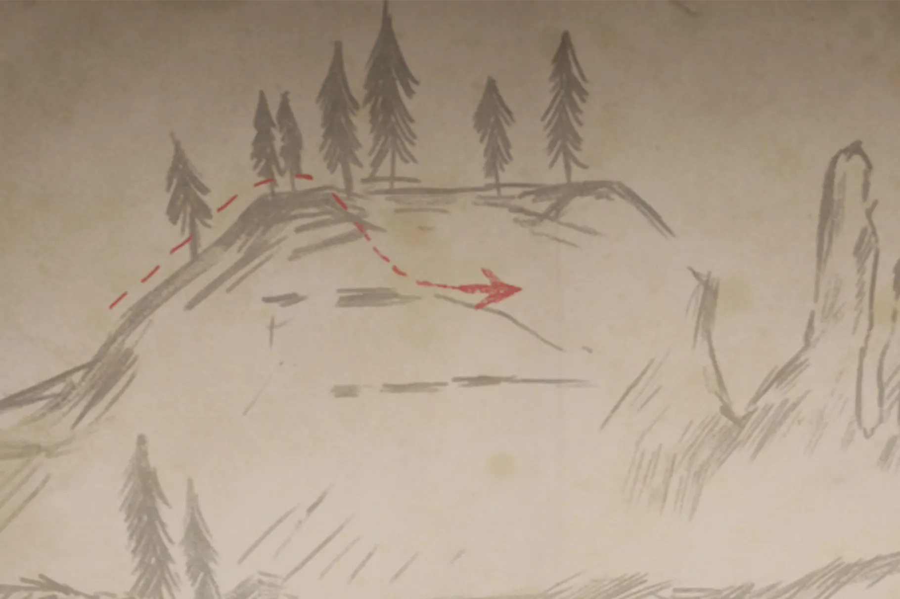
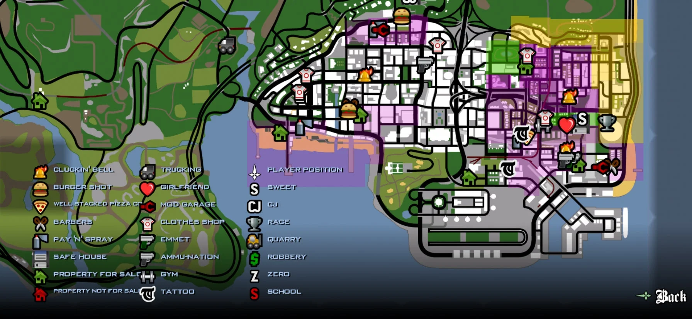

[Main page](../../../readme.md)

# Map
Usually in open world games navigation can be challenging similar to real world. Some games even when they are corridor based have complex map layout and therefore a map can be helpful. Map can be also present checkpoints and landmarks in a less intrusive way compared to light beams or arrows inside the game it self.

## Minimap
Is presented as HUD element on the game screen.
It can be hand drawn by an artist, which can be challenging when the level design changes during development or it can be automatically generated by the game engine, which is a more scalable solution. The level it self contains a special layer with geometry which is draw only in the minimap or large map. The game camera cant see the minimap geometry and the minimap topdown camera cant see the game geometry.

***Red dead redemption II mini map***\

## Large map
Large maps can be hand drawn, stylised, or automatically generated similar to a minimap.
But they also contain panning and zooming.

***Kingdom Come deliverence large map***\

## Treasure map
Is usually a simple image of a hand drawn map, more like a doodle which shows a landmark similar to what is on map and a cross sign which identifies as a treasure or secret location. Inventory maps can be fun to search for, because they require more attention to your environment then during regular gameplay.

***Red dead redemption II treasure map***\

## Checkpoints
Are target highlighted on the map and visualise certain important location.
Such an location can be for example a starting point of a mission. Grand theft auto series use mission checkpoints to visualise the start of a progress in a campaign or identifies a side quest or side mission which are not important to the main storyline.

## Routes
Some games visualise a specific route almost like a GPS. In open world games it can be hard to navigate through the world, because in the direction of our mission we can have a very long wall, cliff or a river and it could take a lot of time to find a way to cross it, routes can shorten us the time to find an optimal route towards our goal.

## Areas
Some games visualise areas on map with different colours. Thos ereas can identify that certain portion of map is dangerous, or it belongs to a specific gang, race or species and if our character is not ally to that, it will certainly put us in a greater danger.

***GTA San Andreas gang areas***\

Work in progress...