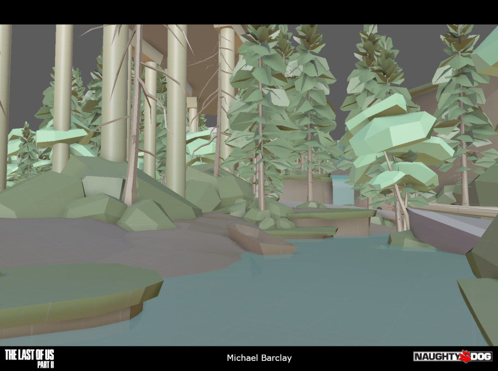
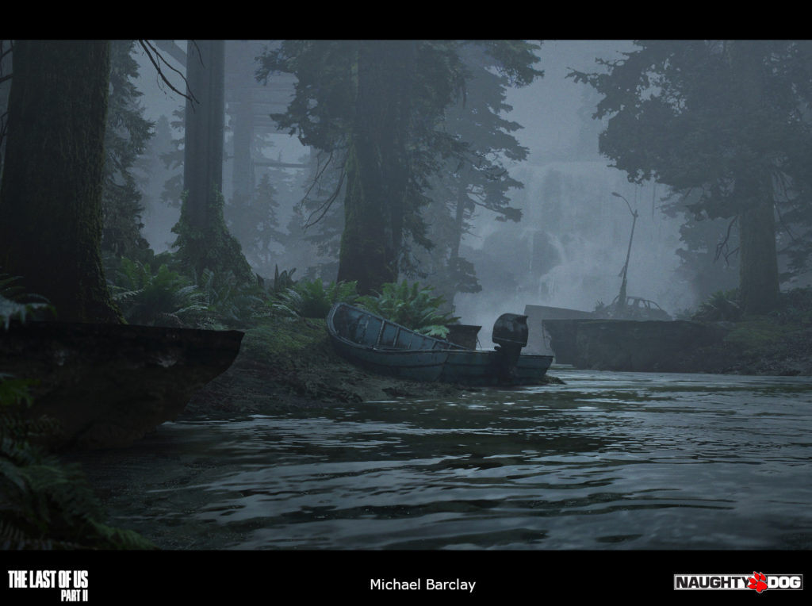
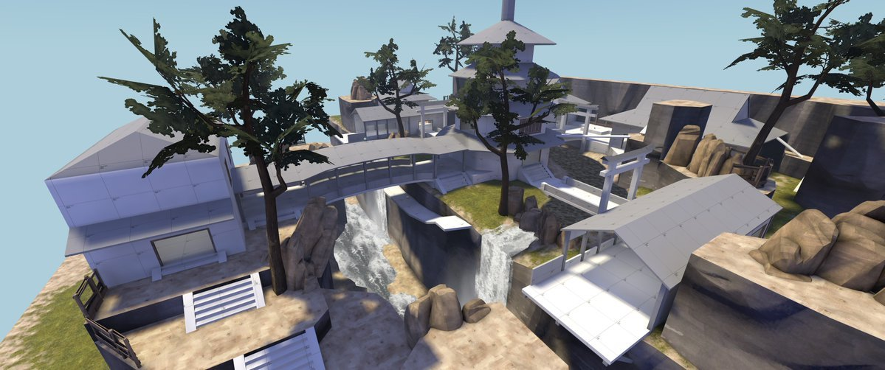
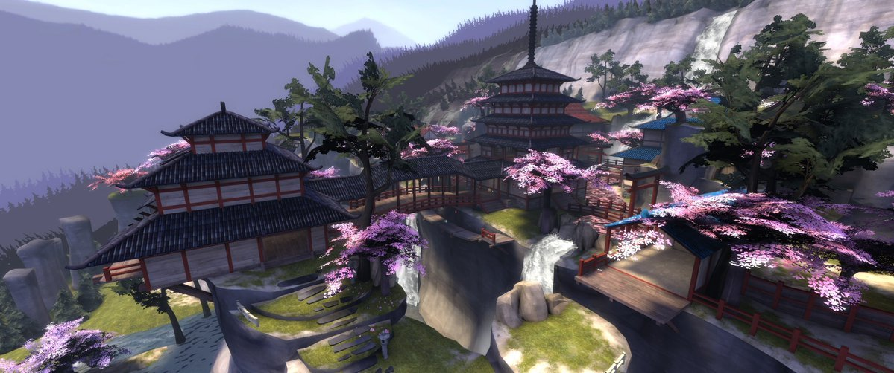
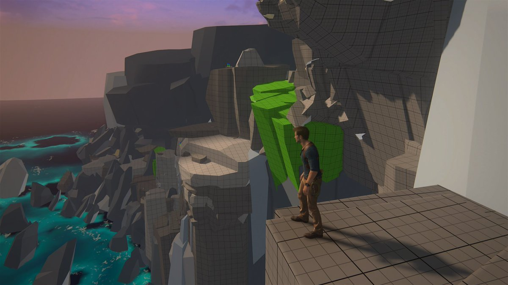

[World](world.md)

# World design blocking

Most major games use blocking technique for designing its worlds.
Blocking means that we just use primitive shapes like boxes, cylinders, spheres for 
creating the basic shape of our level. We never start modelling any assets in to our game
until the level design blocking is done. Why?

Imagine following scenario.
- Level Designer creates first version of our world.
- CGI artist creates props for the world.
- Level Designer modifies our world and removes half of the props needed and adds more.
- CGI artist is annoyed that his work has been scrapped. Continues modelling new props.
- Level Designer modifies our world and removes some parts of the world.
- CGI artist is frustrated as his work is clearly wasteful.
- Level designer scraps the whole level because playtesters dont like the level.
- CGI artist quits the job and moves to a different company.

So how do CGI artists stay happy working at game companies?
- Level Designer creates first version of our world and does a playtest.
- Tester plays the level and brigs comments.
- Level Designer integrates those comments in the world and creates additional changes.
- Tester plays the level and finds bugs in collisions.
- Level Designer fixes bugs in collisions and also adds new vistas.
- Tester gets lost in the new vista and reports it.
- Level Designer simplifies the vista and makes an update.
- Tester cant find any issues with the level and plays the game more then he should.
- Level is considered finished and is now handled to CGI artist to create assets for the level.

***The Last Of Us***  

***Team Fortress 2***  

***Uncharted***  

