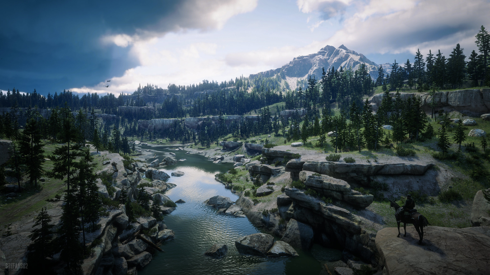
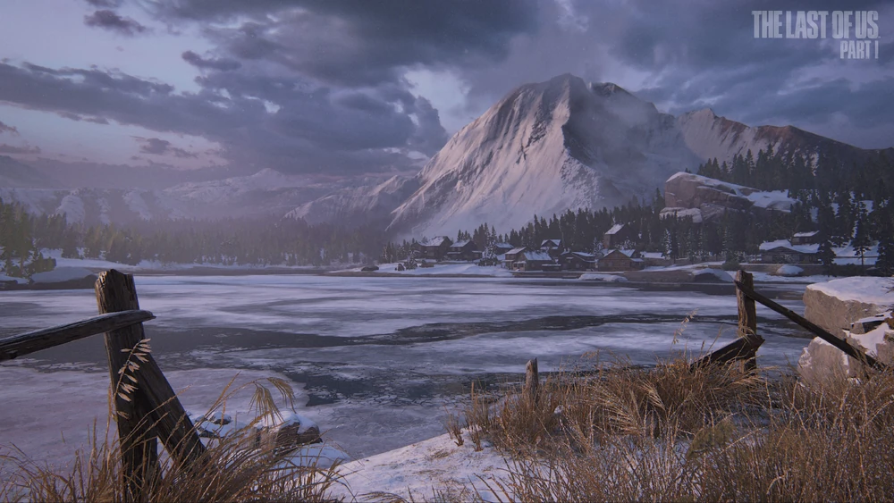
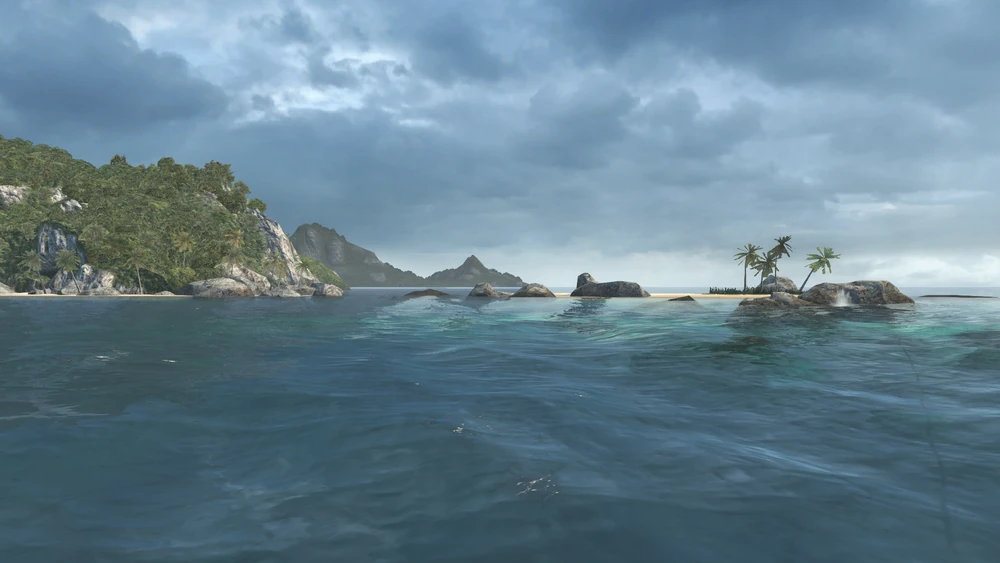
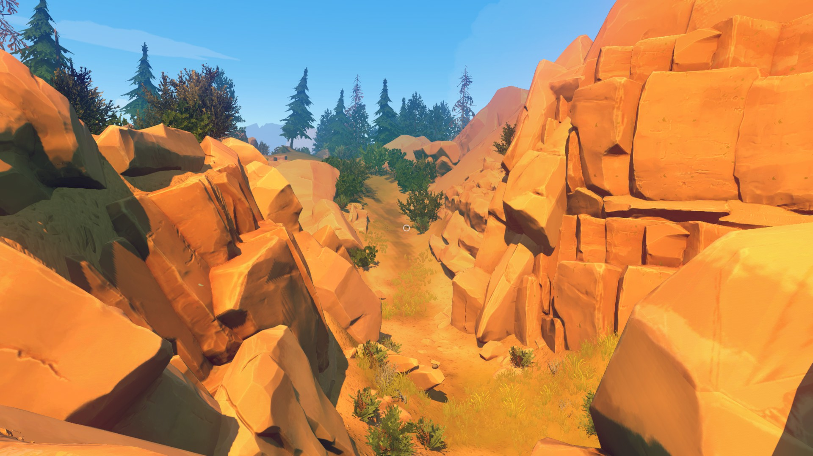
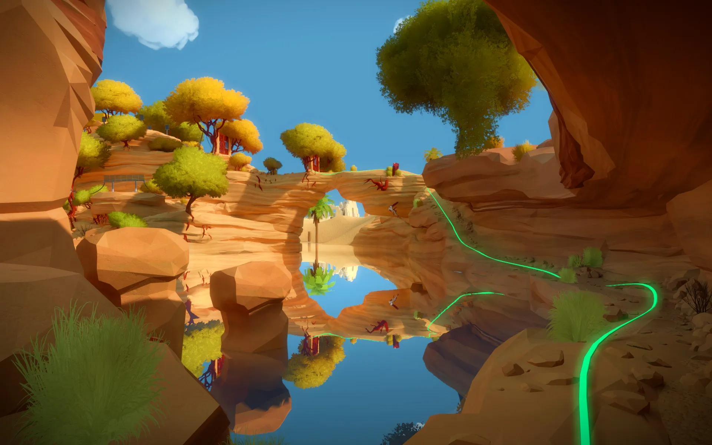
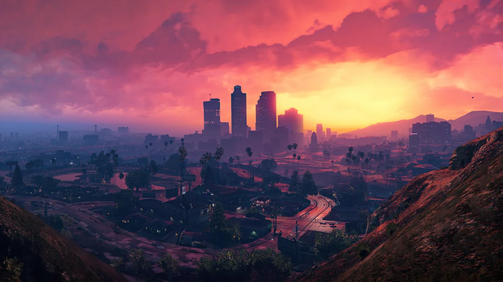
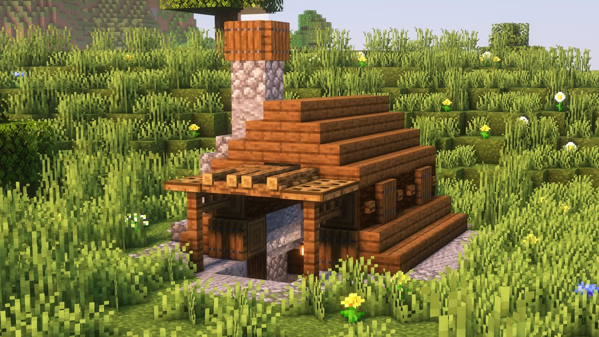
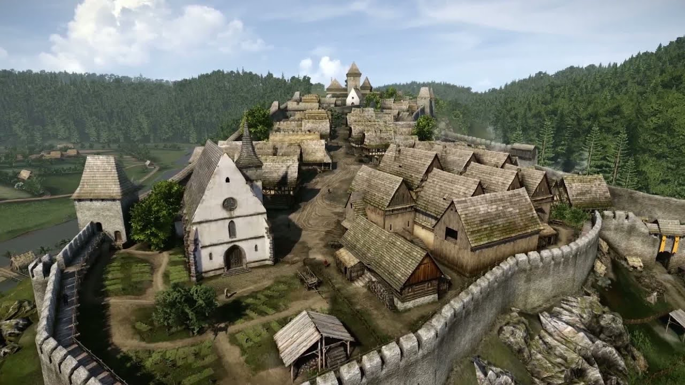

[World](world.md)

# World Terrain

World terrain creates natural paths and barriers which feels almost invisible.
They are not distracting, they don't appear like a threating sign "Do not walk!"
We respect those boundaries naturally from personal experience.

***Red Dead Redemption 2 river***  

***Last Of Us lake***  

***Assassin's Creed Black Flag sea***  

***Firewatch trail***  

***The Witness bridge***  

***Grand Theft Auto 5 city***  

***Minecraft shelter***  

***Kingdom Come Deliverence castle***  

- water
    - streams
    - rivers
    - ponds
    - lakes
    - seas
- paths
    - trails
    - roads
    - crossroads
    - dead ends
- formations
    - hills
    - rocks
    - mountains
    - cliffs
    - caves
- urban
    - shelters
    - cabins    
    - willages    
    - castles
    - cities
        - centre
        - downtown
        - uptown
    - mines
    - factories
    - harbours
    - parks