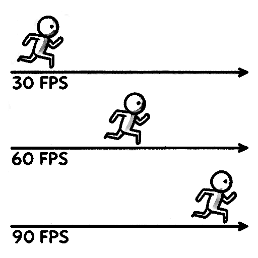

[Main page](../../../readme.md)

# Time

Games are considered one of the hardest discipline in computer science because they have to run in realtime.  
Realtime means that our game has to be responsive towards user input. If the game would take 1 second to respond to user input it would be still considered realtime application but from game perspective it could be unplayable.

# History

Early games did not use time for controlling speed of the game but rather used the number of frames to update the game it self. This behavior had the benefit of the simplicity of the code but also one big downside and that was, whenever we put the game on a faster machine, the game as well ran faster. Which could increase the difficulty of the game, which was undesirable.

# Present

Modern games do not use frames but rather keep track of time. We move objects in the game with certain
velocity, that means certain distance per second. This has the benefit that no matter how fast the game runs, therefore how many FPS do we have, the game behaves almost the same. However, this makes the game development much more difficult because we need to be aware of this behavior, because if we don't understand what is happening we usually end up with undesired outcomes.

# FPS

Frames per second  
We measure the speed of our game in number of rendered frames per second.  
The more frames we render per second the faster our game runs.  
[Nvidia article about FPS in eSports](https://www.nvidia.com/en-us/geforce/news/what-is-fps-and-how-it-helps-you-win-games/)

***Nvidia fps animation smoothness***\

# One game, three devices

Imagine a single game running on three different devices.

- mobile phone
  - game runs at 30 FPS

- gaming console
  - game runs at 60 FPS

- high-end pc.
  - game runs at 90 FPS

If our player would update its position 1 meter per frame  

- mobile phone player would run 30 meters per second
- gaming console player would run 60 meters per second
- high-end pc player would run 90 meters per second.

That would be highly undesirable because with high end pc the difficulty of the game increases 3x.  
What if we instead make sure that our player runs always at the same speed?  

- mobile phone player has to run 1/30 meters per frame.
- gaming console player has to run 1/60 meters per frame.
- high-end pc player has to run 1/90 meters per frame.

This way we can tell that the player always moves 1 meter per second on all devices.

But there is a catch...
All those devices never run exactly at the same framerate.
They always fluctuate, due to:

- complexity of our game
- concurrency / multiple apps running simultaneously
- thermals / overheating
- low battery

That means that our fraction cannot be a constant.

# Delta Time

Instead we can calculate our fraction by measuring the duration of our previous frame.  
This fraction is called delta time.  
[Unity delta time](https://docs.unity3d.com/ScriptReference/Time-deltaTime.html)  

If we multiply our player speed with delta time each frame, our player would run  
at the same speed no matter what is the frame rate of our game on any device.