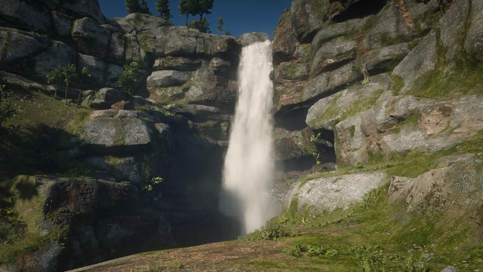
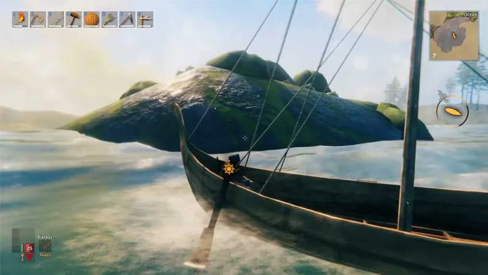
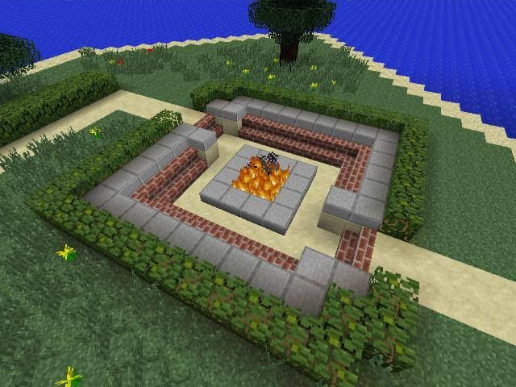
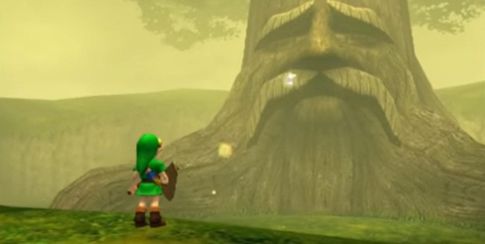
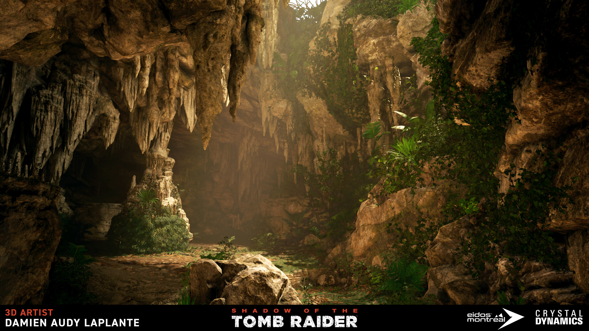

[World](world.md)

# World landmarks

Our environment is made of terrain but very often we need to focus the attention
to a very specific place. We want those places to be memorable.
Those memorable places can be called landmarks.

***Bioshock Infinite Monument***  

***Red dead redemption 2 Brandywine Drop***  

***Valheim Island***  

***Minecraft fireplace***  

***World of Warcraft mountain***  

***Legend of Zelda Great deku tree***  

***Shadow Of Tomb Rider Cave***  

- Nature
    - vistas
    - waterfalls
    - water surface "ponds, lakes"
    - hills
    - mountains
    - unique trees
    - caves
    - islands
- Urban
    - fire places
    - crossroads
    - parks
    - bridges
    - factories
    - mines
    - statues
    - monuments

