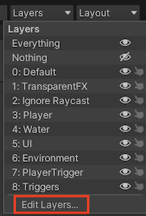
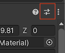
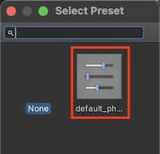

[Main page](../../readme.md)

## Prerequisites
- [Install the Git client (minimum version 2.14.0) on your computer.](https://git-scm.com/downloads)
- [Install the Git LFS client on your computer.](https://git-lfs.com/)

## Procedure
- Open Package Manager from Window/Package Manager
- Open the add  menu in the Package Manager’s toolbar.
- The options for adding packages appear.

- Select Add package from git URL from the add menu.  
- Fill the text box with URL:  
`git@github.com:jaroslavstehlik/GameDevForBeginners.git`
- Hit OK.  

## Prepare project
- Edit layers

- Open layer presets

- Apply layer preset

- Open physics settings from Edit/Project Settings

- Open physics presets

- Apply physics preset

You are now all set!