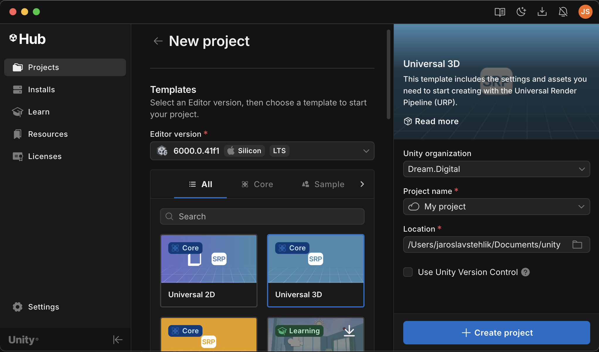
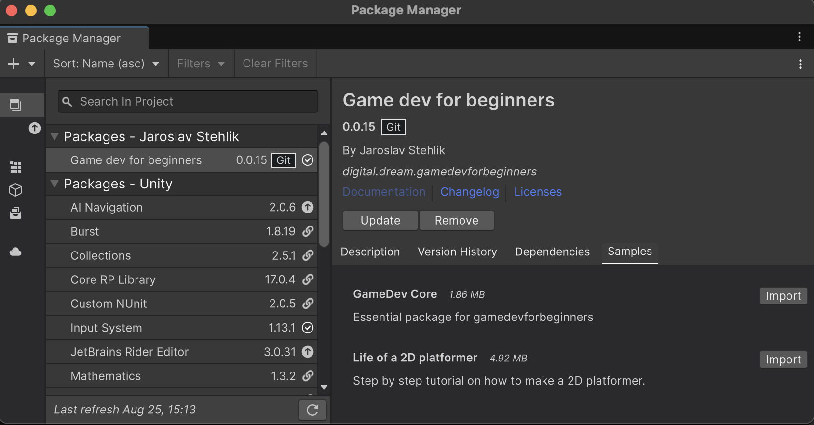
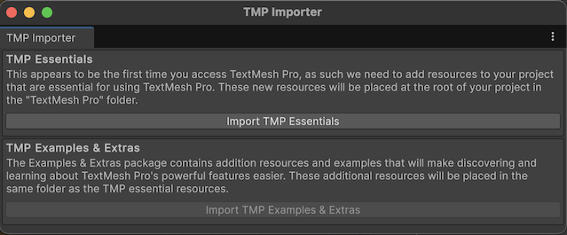
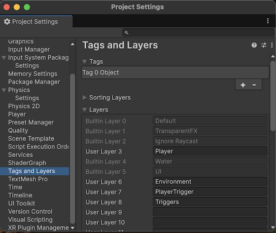
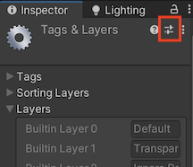
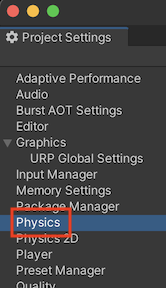
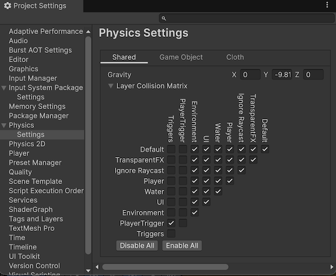

# installation

## Before we start

- [Instal Unity3D minimum version: 6000.0.41f1 from Unity hub.](https://unity.com/download)
- [Install Git (minimum version 2.14.0) on your computer.](https://git-scm.com/downloads)
- [Install Git LFS on your computer.](https://git-lfs.com/)

## Create new Unity project

- Select Unity version 6000.0.41f1
- Select Universal 3D preset
- Name your project
- Create project  

## Import package

- Open Package Manager in Unity3D from Window/Package Manager.
- Open the add  menu in the Package Manager’s toolbar.
- The options for adding packages appear.  

- Select Add package from git URL from the add menu.  
- Fill the text box with URL:  
`https://github.com/jaroslavstehlik/GameDevForBeginners.git`
- Hit OK.  

## Import samples

- Open menu Window/Package Manager/Packages
- Select Game dev for beginners package.
- Select samples tab
- Import GameDev Core  

## Prepare project

### Text mesh pro essential resources
- Open menu Windows/TextMeshPro/Import TMP Essential resources  

### Rename layers
- Open menu Edit/Project Settings/Tags and Layers  

- Open layer presets  

- Apply layer preset  

### Setup physics collision matrix
- Open menu Edit/Project Settings/Physics/Settings  

- Enable layers as in picture  

- Repeat for 2D physics

You are now all set!