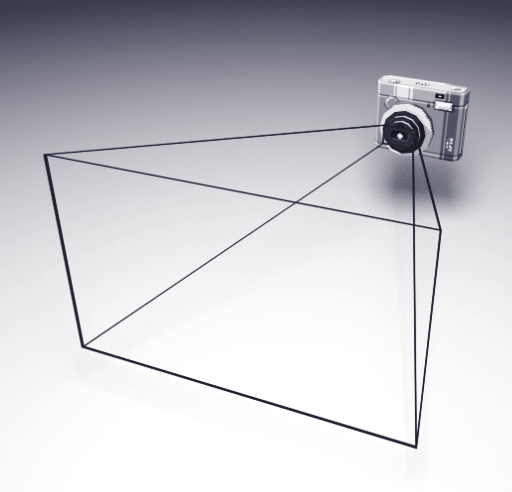
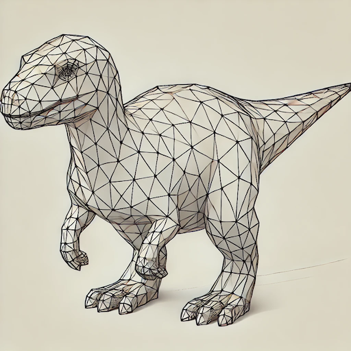
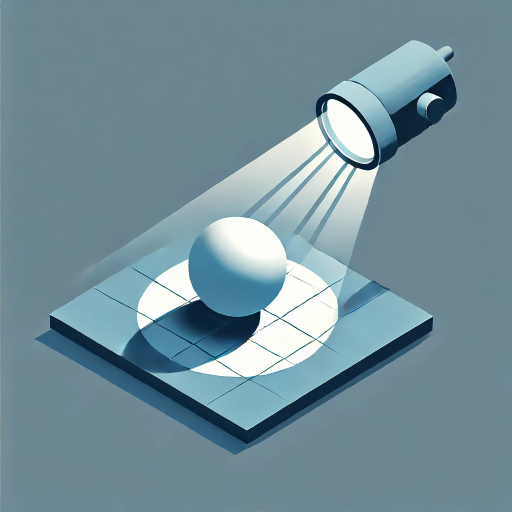

# Rendering

Games have to somehow give feedback to the player. The very early games used only text because the hardware did not had the performance to render anything more complicated. When the computer and gaming consoles obtained a dedicated graphics chip, games became visually more sophisticated and the visuals of the game became one of the key aspect in promoting the game.

The process of rendering can be broken in several parts.
Camera -> Scene -> Meshes -> Materials -> Lights -> Screen

## Camera

Game camera is very similar to a physical or smartphone camera. It mimics a lens which has a focal length which defines the field of view. Every camera has a sensor which detects light, in games the sensor is our screen. The screen therefore the sensor defines our image aspect ratio. The main difference between game camera and physical camera is that game cameras have a primitive called frustum. 

- Frustum is defined by near and far clip planes and the field of view of the camera. The purpose of the camera frustum is to filter only the meshes from the scene which should be visible and reject the one which are not visible. This process is called frustum culling. This is the main optimization step of every game engine.

# Scene

The camera traverses the scene and looks for every object which should be rendered, as said before the objects are being filtered using the camera frustum. Some game engines also use occlusion culling, which is basically a method which rejects geometry which would be not visible in the final image due to occluding geometry.

# Meshes

Each mesh is made of vertices and triangles. Those triangles are being combined based on the material. If multiple meshes have same material, they can be combined in to a single bigger mesh. This is called batching and its also a very important optimization step.

# Materials

When meshes are batched to gether based on its materials they are also split based on its transparency.

- Opaque meshes are rendered before transparent meshes and the main reason is again optimization.
We first need to sort the opaque meshes based on the camera distance. We render the nearest meshes to the camera first and the furthest meshes as last. In order that we never render pixels which are invisible we use a special texture called depth texture. Everytime a pixel is drawn on the screen it first looks in the depth buffer to check if a pixel with closer depth value has been already drawn and if it was, we simply don't render that pixel.

- Transparent meshes have to be also sorted based on the distance from the camera but in opposite direction. The furthest meshes are drawn first and then the closest meshes are drawn last. This technique is called the painters algorithm and it  mimics the way how painters draw a picture.

# Lights

Our objects usually should respond to lighting, so we need to collect all lights from the scene and make sure that each light is contributing to the final picture. There are two most common ways of rendering lights in games.

- Forward rendering. It renders the mesh as many times as there are light affecting it.
The mesh is additively added to the final picture. The main benefit of forward rendering is simplicity when not many lights is being rendered and also great anti-aliasing of edges.

- Deferred rendering. It renders each opaque mesh usually 4 or more times in to separate textures.
Usually color texture, depth texture, normals texture and PBR texture. When we then combine those texture, we can very easily render those lights as an image filter / post effect. Deferred rendering is great for rendering large amount of lights, but it is very hard to keep edges smooth. Anti-aliasing in deferred rendering is usually complex and produces a blurry image with jaggy edges. Transparent meshes have to use forward rendering.

# Screen

The last step is to present the final image to the screen. During this process we also apply many post effects like color correction to create a more filmic look, but also bloom effects and lens flares to simulate physical camera lens effects. If the game uses deferred rendering it also has to smooth out jaggy edges. This effect is called anti-aliasing. There are many different ways of achieving smooth edges, but none of them is perfect.