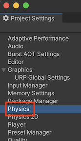
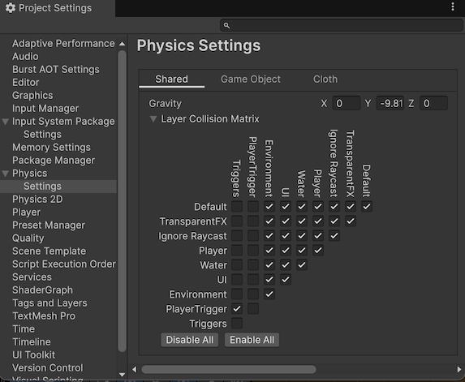

# installation

## Prerequisites

- [Instal Unity3D minimum version: 6000.0.41f1 from Unity hub.](https://unity.com/download)
- [Install Git (minimum version 2.14.0) on your computer.](https://git-scm.com/downloads)
- [Install Git LFS on your computer.](https://git-lfs.com/)

## Procedure

- Open Package Manager in Unity3D from Window/Package Manager.
- Open the add  menu in the Package Manager’s toolbar.
- The options for adding packages appear.  

- Select Add package from git URL from the add menu.  
- Fill the text box with URL:  
`https://github.com/jaroslavstehlik/GameDevForBeginners.git`
- Hit OK.  

## Prepare project

- Open menu Edit/Project Settings/Tags and Layers

- Open layer presets  

- Apply layer preset  

- Open menu Edit/Project Settings/Physics/Settings

- Enable layers as in picture

- Repeat for 2D physics

You are now all set!