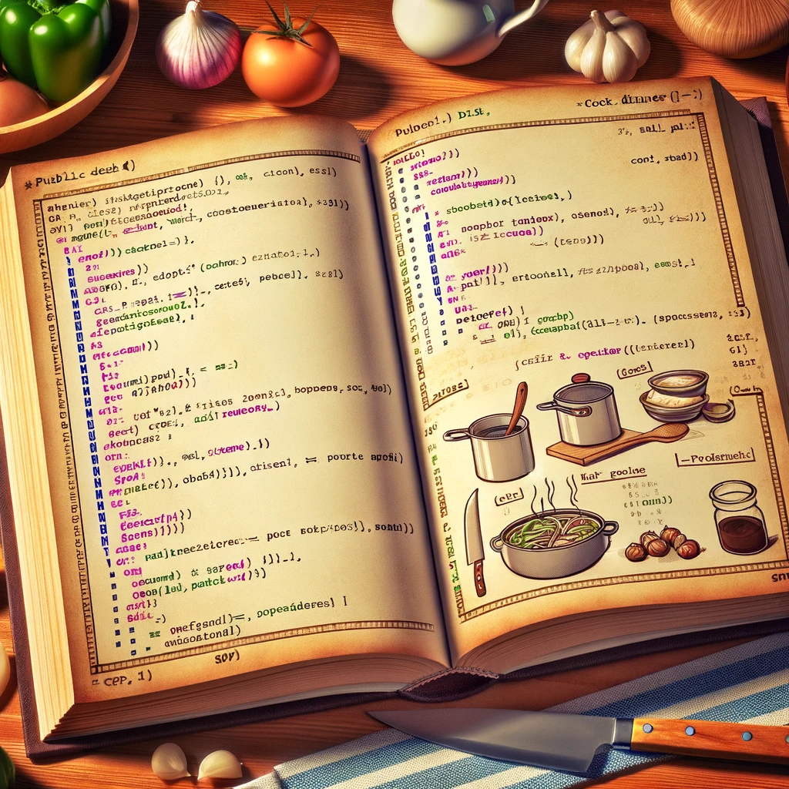

# Programming vs cooking



Programming can be compared to a cooking recipe.

Cooking recipe needs:
ingredients and Instructions on how to prepare ingredients in to actual meal.
```
egg
ounce of white flour
cup of milk
pinch of salt

put everything in a bowl, make a dough
and put it in an oven for 10 minutes auntil it
has a nice gold color.

Serve with a huge smile on your face
```

Programming is similar in that it needs:
data and Instructions on how to prepare data in to actual desired result.
```csharp
// our data
int numberOfEggs = 1;
float gramsOfWheat = 500f;
float litresOfMilk = 0.5f;
float cookingTimeInMinutes = 10f;

// our instructions
void Start()
{
	// we modify our data and output it to the screen
	Debug.log("huge smile on my face: " + (number * time));
}
```

The main difference between programming and cooking is that
cooking is very often vague in many aspects, which is also the 
reason why many people even if they follow a recipe very closely they
end up with different results than what was the original expectation.

The goal of programming and computer science in general is to write set of instructions which always produces the same result. Which is the foundation of any scientific research.
But we don't have to be scientists or do scientific research in order to just enjoy the fact that
we always get the same result with the same set of instructions.

Computers and programming languages have evolved to be very specific and very deterministic.
We do not use terms like: little, large, medium sized, few, a lot, a hand full, small spoon, large spoon, pinch of salt. All those words really do not describe what amount are we really talking about.

In cooking when we describe for example the color, we usually say things like:
brownish, gold, pinkish, red, dark, light, burned, creamy and so on. It still does not accurately represent any specific property of the cooked ingredient.

That is the reason why cooking needs great deal of experience and understanding how different ingredients behave under different conditions. For example how much moisture does the food contain, how high heat do we apply and for how long. If we start understanding those relations we are in fact becoming something closer to a chemist.

In programming we want to know exactly how large and what shape our data is in.
That is why some programming languages have came up with data types.
We also want to know which instructions our data will be processed with and what end result from those changes we will remain. Those instructions are usually called functions.

So in programming we mostly care about data and functions.