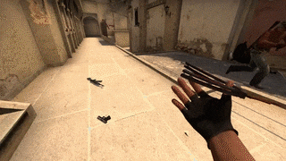
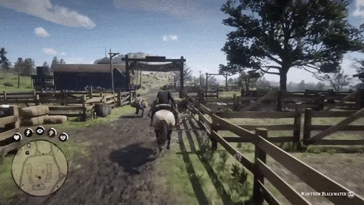

# Camera
Without a proper camera in our game we would be unable to see the player or the world.  
A camera is trying to mimic a physical camera in real world.
It has a position, orientation, aspect ratio and field of view.

Most common camera behaviours in games
# Fixed camera

***Resident evil 2***\


You just place your camera in the scene without any script

# Follow camera

***Super Mario Bros 3***\


Simplest camera which just follows the target with slight delay

```csharp
using UnityEngine;

public class FollowCamera : MonoBehaviour
{
    public Transform target;
    public Vector3 offset = new Vector3(0f, 10f, 0f);
    public float speed = 0.5f;
    
    private void LateUpdate()
    {
        transform.position = LerpUtils.Lerp(transform.position, target.position + offset, Time.deltaTime * speed);
    }
}
```

# First person camera

***CS GO***\


Slightly advanced camera which allows the player to look around

```csharp
using UnityEngine;

public class FirstPersonCamera : MonoBehaviour
{
    public Transform target;
    public float mouseSensitivity = 1f;
    public bool flipMouseY = true;
    public float cameraYaw = 0;
    public float cameraPitch = 0;
    
    private void LateUpdate()
    {
        float mouseX = Input.GetAxis("Mouse X");
        cameraYaw += mouseX * mouseSensitivity * 10f;
        
        float mouseY = Input.GetAxis("Mouse Y");
        if (flipMouseY)
            mouseY *= -1f;

        cameraPitch += mouseY * 10f * mouseSensitivity;

        transform.position = target.position;
        transform.rotation = Quaternion.Euler(cameraPitch, cameraYaw, 0f);
    }
}

```

# Third person camera

***Red Dead Redemption***\


Advanced camera which adds certain offset from player.
The movement of the camera is called camera orbit as it orbits around the player.
When the camera detects collision between player and camera it comes closer to prevent occlusion.
It allows custom distance from player by using mouse scroll wheel.

```csharp
using UnityEngine;

public class ThirdPersonCamera : MonoBehaviour
{
    public Transform target;
    public Vector2 minMaxDistance = new Vector2(0.25f, 5f);
    public float mouseSensitivity = 1f;
    public float mouseScrollWheelSensitivity = 1f;
    public bool flipMouseY = true;
    public float cameraYaw = 0;
    public float cameraPitch = 0;
    public float cameraDistance = 10f;
    public LayerMask cameraCollisionMask;
    public float cameraRadius = 0.1f;

    private void LateUpdate()
    {
        float mouseX = Input.GetAxis("Mouse X");
        cameraYaw += mouseX * mouseSensitivity * 10f;
        
        float mouseY = Input.GetAxis("Mouse Y");
        if (flipMouseY)
            mouseY *= -1f;

        // clamp horizon
        cameraPitch = Mathf.Clamp(cameraPitch + mouseY * 10f * mouseSensitivity, -90, 90);
        Quaternion rotation = Quaternion.Euler(cameraPitch, cameraYaw, 0f);
        
        Vector3 targetPosition = target.position;
        Vector3 targetDirection = rotation * Vector3.forward;

        float mouseScrollWheel = Input.GetAxis("Mouse ScrollWheel");
        cameraDistance = Mathf.Clamp(cameraDistance + mouseScrollWheel * mouseScrollWheelSensitivity, minMaxDistance.x, minMaxDistance.y);
        
        Ray sphereCastRay = new Ray(targetPosition, -targetDirection);
        RaycastHit raycastHit;
        bool hit = Physics.SphereCast(sphereCastRay, cameraRadius, out raycastHit, minMaxDistance.y, cameraCollisionMask,
            QueryTriggerInteraction.Ignore);

        float actualCameraDistance = Vector3.Distance(targetPosition, transform.position);
        float cameraDistanceWithPhysics = Mathf.Lerp(actualCameraDistance, cameraDistance, Lerp.Smooth(0.1f));
        if (hit)
        {
            cameraDistanceWithPhysics = Mathf.Min(cameraDistance, raycastHit.distance);
        }
        
        transform.position = targetPosition - targetDirection * cameraDistanceWithPhysics;
        transform.rotation = rotation;
    }
}
```