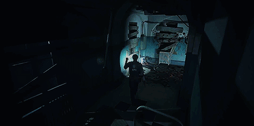
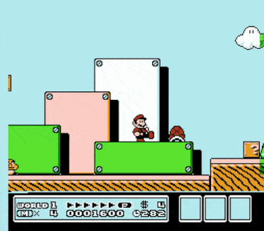

[Main page](../../readme.md)

# Camera
Without a proper camera in our game we would be unable to see the player or the world.  
A camera is trying to mimic a physical camera in real world.
It has a position, orientation, aspect ratio and field of view.

Most common camera behaviours in games
# Fixed camera

***Resident evil 2***\

You just place your camera in the scene without any script

# Follow camera

***Super Mario Bros 3***\

Simplest camera which just follows the target with slight delay

[source code | FollowCamera.cs](../Unity/Assets/Camera/FollowCamera.cs)

# First person camera

***CS GO***\

Slightly advanced camera which allows the player to look around

[source code | FirstPersonCamera.cs](../Unity/Assets/Camera/FirstPersonCamera.cs)

# Third person camera

***Red Dead Redemption***\

Advanced camera which adds certain offset from player.
The movement of the camera is called camera orbit as it orbits around the player.
When the camera detects collision between player and camera it comes closer to prevent occlusion.
It allows custom distance from player by using mouse scroll wheel.

[source code | ThirdPersonCamera.cs](../Unity/Assets/Camera/ThirdPersonCamera.cs)