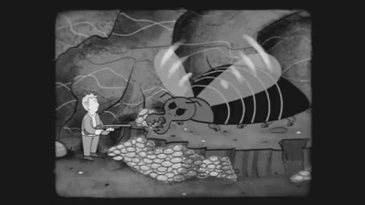

# Chance
In games pure luck or chance are often important to make the game more interesting or to make the game playable more than once.

***Fallout luck fairy***\

In game engines we talk about chance as randomness.
We use a random number generator which acts similar to a board game dice.
When designing games with randomness in mind, it is quite important to also keep in mind the odds of a certain event happening.

Imagine that if we have a 2 sided dice, we have 1/2 therefore 50% probability of an specific event occurring. If we have a 6 sided dice the probability of an event happening becomes 1/6 therefore 16%.

To obtain a random number we need a function which generates random numbers and a seed. Seed is a special number which makes sure that our random generation
stays always the same. We want the randomly generated numbers to stay the same each run so we can actually test the game and find bugs.