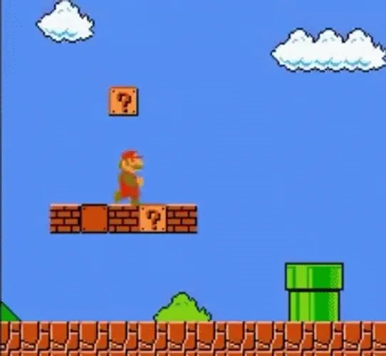
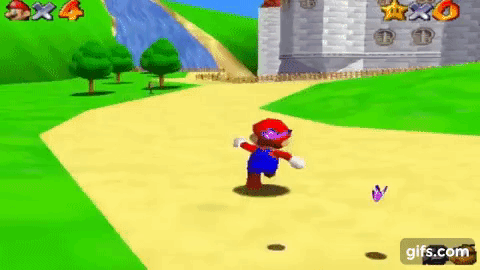

[Main page](../../readme.md)

# Character controller
Is the second most important element in most games. It can be as simple as a dot navigating on a grid and as complex as Assassin's Creed character which climbs and runs on walls or Spider man character which can swing from building to building. The main objective is design. We need to limit our character abilities to fit our level design.

***Super mario bros character controller***\

# Basic Character controller

Our example character controller can walk, run and jump.

[source code | CharacterControllerBasic.cs](../Unity/Assets/CharacterController/Basic/CharacterControllerBasic.cs)

More advanced character controllers could do a even more.

double jump, fly, dive, climb, wall run.
Those abilities are called states.
The complexity of the character controller depends on how many states in can be
and how complicated the state it self is.

***Super mario 64 triple jump***\

***Assassin's Creed jump***\

***CS GO surfing***\

Going from one state to another is called state transition.
State transitions can be done by certain button or walking near a specific trigger.
Wall climbing state could be activated when walking near wall.
Ladder climbing can be activated by a specific button near a ladder.

Designing character controllers is a very specific discipline and has usually a dedicated
game designer who works in tandem with a level designer.
