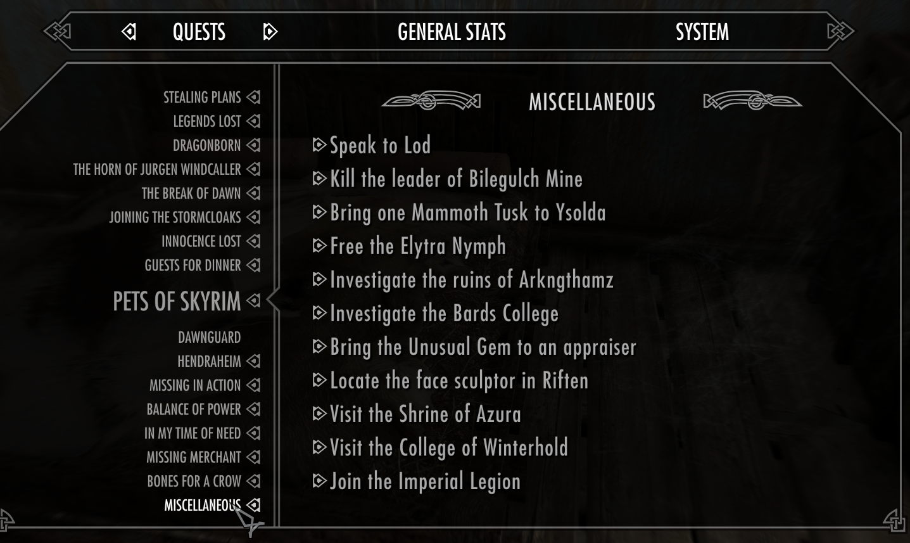

# Quests
Many RPG games have quests or objectives. Most modern games even if they are casual and don't represent them selves as RPG games have some sort of objectives.

The Elder Scrolls V: Skyrim quests

A quest is basically a task and a quest log is just a Todo list.
Quest needs a unique name so it can be easily understood by the player but also remembered by the game it self that it has been already completed. 

## Linear quests

Have to be finished in order so we can advance to the next quest.
The benefit of linear quests is that there is a clear progression, the player is not overwhelmed with decisions on which quest to start. This is usually the main storyline.

## Parallel quests

When navigating large scale world, we can encounter many NPCs which can give us small quests, we don't have to start or finish those tasks immediately. The benefit is that the player decides on which tasks to take and in which order, but it can also put pressure on the player to decide which task to start or that they have unfinished quests which they don't want to finish. This is usually kept for side missions which are not important for the main storyline.