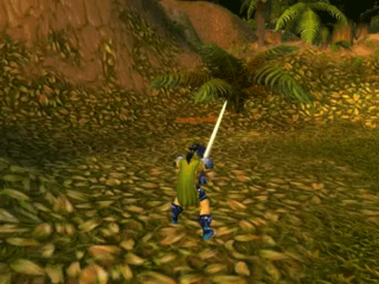

# Score, Level or currency
Score is used for keeping track of player progress, level progress or amount of currency held. In a platformer game it would be the number of stars collected, in a zombie game it could represent the amount of zombies killed. In a strategy game it would be the amount of gold we have extracted. In an RPG game a level would show how much skill have we gained by progressing in the game.

***World of warcraft level up***\

## Lifetime
It is important to know the lifetime of a score.

- **Mini game/mission**, means it will reset whenever a mini game is triggered.
- **Level**, means it will reset whenever another level loads.
- **Game**, means it will reset whenever we quit the game.
- **Save slot**, means it will reset whenever we create a new save slot.

## Owners
It is good to know who that score belongs to.

- **player**, obviously most common location would be our player
- **Other players**, in a multiplayer game we want to know score of our friends.
- **NPCs**, when we want to loot an NPC we need to know their amount of currency.
- **Inventory**, we can store currency inside chests or inventories as well.

## Modifiers
The game needs to be able to modify the score during certain game events.

- **Add**, during game we need to add the score whenever player collects a star or kills a zombie. 
- **Subtract**, during game we want to remove some score progress, we can do it as a form of punishment or we can use it as consumable. Spending our score as currency for exchanging goods or power-ups.

## Readers
We often need to present score or currency to the player to inform about our progress.
If we collect stars and do not see that a score has increased the player does not understand that we keep track of it.

- **UI**, most common reader is the user interface where we present how much has score increased or decreased during gameplay.
- **Trigger**, can open doors for example when the score has reached certain value.
- **Merchant**, NPCs in games can trade goods with us, but without keeping track of currency we could be buying their entire inventory in just few seconds. 

# Implementation
Score can be implemented as a single integer value.
The important decision is where do we store the integer value.

- **Script** on player for example will live only until our player script exists. During level loadings or player destruction our player will loose score.
- **Project** the value will exist until the game quits. During level transitions we will not loose score, but when we quit the game the score will reset.
- **PlayerPrefs**, the value will exist until next game launch and will be never cleared if we don't clear it our selves.