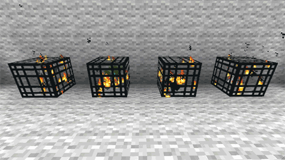

# spawners
Spawners are areas which spawn specific units. Those units can be enemies, loot, npcs basically everything in the game which needs to respawn at a certain time is considered spawner. 

***Minecraft monster spawner***\

## Object to spawn
We have to spawn something, otherwise it would be not considered a spawner.
That something is usually a game element or a unit.

## Event
The object has to spawn at a specific time called event.
We usually spawn things at a specific interval, for example once in a minute.
Or we spawn things when we kill an enemy, another enemy is spawned, therefore
the number of enemies remains constant.

## Instance Spawner

```csharp
using UnityEngine;
using UnityEngine.Events;

public class InstanceSpawner : MonoBehaviour
{
    // Public event when spawner spawns an object
    public UnityEvent<GameObject> onSpawn;
    
    // GameObject to spawn
    public GameObject spawnGameObject;

    // Where to place our spawned object
    public Transform spawnLocation;

    public void Spawn()
    {
        // Clone the game object and store it in local variable
        GameObject spawnedGameObject = Instantiate(spawnGameObject);
            
        // Set the parent hierarchy transform to spawn location
        // This will prevent clutter in the scene
        spawnedGameObject.transform.SetParent(spawnLocation);
            
        // Set the spawned game object position to our spawn location
        spawnedGameObject.transform.position = spawnLocation.position;
            
        // Set the spawned game object rotation to our spawn location
        spawnedGameObject.transform.rotation = spawnLocation.rotation;
            
        // Check if anyone listens to our event
        if (onSpawn != null)
        {
            // Invoke event
            onSpawn.Invoke(spawnedGameObject);
        }
    }
}
```
In combination with a timer we clone the spawned game object every duration we set. 
This implementation has few issues however.

- The longer the spawner exists the more it spawns objects which might in best case decrease our game frame rate and in worst case crash our game. This can be resolved by a another timer which destroys the spawned objects
- Spawning GameObjects can create hiccups in our game, which will affect smoothness of our gameplay.

So what can we do to make this safer? Lets use a memory pool.
A memory pool is just an array of GameObjects which are instantiated when needed. Individual objects are disabled and when the spawner is about to spawn an object it just moves the object to the spawn location, resets all its states and turns its visibility on.

## Memory pool
Usually we don't want to spawn many new elements at once because they very often cause hiccups. A hiccup in a game is caused by some operation which takes too much time. If we create elements when the game loads instead ahead of time, we still get some hiccup but it is during level loading which is more acceptable. Then during spawning we just enable and disable those elements, which creates the same effect as spawning but without the hiccup.

# Implementation
Spawner can be implemented as:
- **Array**, an array of elements which represents our memory pool.
- **Integer**, representing the current index of an element we want to spawn.
- **Spawn function**, which enables our element in scene and increments the spawn index.
- **Spawn event**
	- Timer, when our timer finishes, we spawn another element.
	- Game event, when our enemy is killed, we spawn another enemy.

# Memory Pool Spawner

```csharp
using UnityEngine;
using UnityEngine.Events;

public class MemoryPoolSpawner : MonoBehaviour
{
    // Public event when spawner spawns an object
    public UnityEvent<GameObject> onSpawn;
    
    // maximum number of GameObjects to spawn
    public int maxSpawnCount = 10;
    
    // GameObject to spawn
    public GameObject spawnGameObject;

    // Where to place our spawned object
    public Transform spawnLocation;

    private GameObject[] memoryPool;

    private int memoryPoolSpawnerIndex = 0;

    private void Awake()
    {
        // Create an array representing our memory pool
        memoryPool = new GameObject[maxSpawnCount];
        
        // Iterate over each element of the array
        for (int i = 0; i < memoryPool.Length; i++)
        {
            // Clone the spawn game object and assign it in the arrays index
            memoryPool[i] = Instantiate(spawnGameObject, spawnLocation);
            
            // Disable the game object immediately
            memoryPool[i].SetActive(false);
        }
    }

    public void Spawn()
    {
        // Get the spawned game object from our memory pool
        GameObject spawnedGameObject = memoryPool[memoryPoolSpawnerIndex];

        // If the object contains rigidbody we need to reset its velocity 
        Rigidbody rigidbody = spawnedGameObject.GetComponent<Rigidbody>();
        if (rigidbody != null)
        {
            rigidbody.velocity = Vector3.zero;
            rigidbody.angularVelocity = Vector3.zero;
        }
        
        // Set the parent hierarchy transform to spawn location
        // This will prevent clutter in the scene
        spawnedGameObject.transform.SetParent(spawnLocation);
        
        // Set the spawned game object position to our spawn location
        spawnedGameObject.transform.position = spawnLocation.position;
        
        // Set the spawned game object rotation to our spawn location
        spawnedGameObject.transform.rotation = spawnLocation.rotation;
        
        // Activate the spawned game object
        spawnedGameObject.SetActive(true);

        // Increment our memory pool spawner index
        memoryPoolSpawnerIndex++;

        // Make sure that our spawner index does not overflow our memory pool
        if (memoryPoolSpawnerIndex >= memoryPool.Length)
            memoryPoolSpawnerIndex = 0;
        
        // Check if anyone listens to our event
        if(onSpawn != null)
            // Invoke event
            onSpawn.Invoke(spawnedGameObject);
    }
}
```

While this implementation is much more efficient, the crucial portion of this implementation is the resetting of state every time we need to spawn the object. 
If the Object has complex states, for example animations, physics or game logic that also needs to be reset whenever we need to spawn an object. 
Keep this in mind, the more complex the state, the more complex the reset becomes as well. In a complex reset state might be actually simpler to use the creation and destruction as this always resets the state to its beginning.