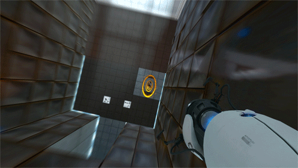

# Teleports or portals
Teleports and portals can save the player some time or they can transport the player to a totally different place on the map, which can cause disorientation and excitement.

***Portal, infinite portal***\

## Trigger
We first need a trigger which detects the player and maybe our objects as well.

## Teleportation point
Then we need a specific place on the map to which the teleport or portal will transport us.

# Implementation
- Trigger, which detects that player or objects has entered the teleport
- Position, which tells where to teleport our player or object