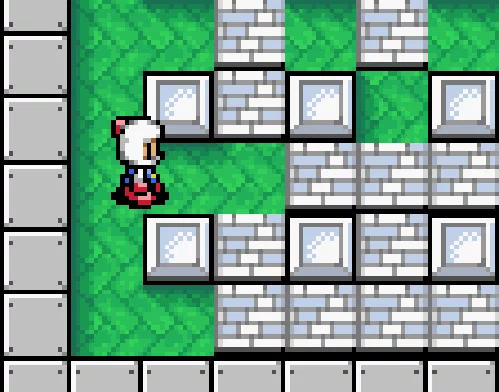

# Timers
Timers are essential blocks for timing certain events. Certain portions of gameplay can be restricted by a timer. Super Mario Bros has a level timer by which the player has to finish the level, otherwise he dies. Super Smash Bros has a match timer which limits the duration of a match during which players have to defeat one another.

Timers play an essential role in many aspects of game play. Spawner has a timer which tells when a certain object or enemy spawns. Spells have very often cooldowns a timer which tells for how long does the player have to wait until they can activate the spell again.

***Bomberman bomb explosion***\

## Duration
Timers have duration in seconds at which the timer has to trigger an event.

# Cycles
Timers can repeat them selves or they can be a one time event.
They can be specified by the number of cycles.

# Events
The event which has to be triggered when the timer ends.

# Implementation
- Duration in seconds
- Coroutine which waits for duration before it executes event.
- Event, trigger an even when the timer ends.

## Basic Timer

```csharp
using System.Collections;
using UnityEngine;
using UnityEngine.Events;

public class BasicTimer : MonoBehaviour
{
    // Public event when timer finishes
    public UnityEvent onTimerFinished;
    
    // Duration of timer
    public float duration = 1f;

    // Should the timer repeat
    public bool repeat = false;
    
    // Define coroutine so we can later stop it
    private IEnumerator coroutine;
    
    // Monobehaviour calls this method when component is enabled in scene
    void OnEnable()
    {
        StartTimer();
    }

    // Monobehaviour calls this method when component is disabled in scene
    void OnDisable()
    {
        StopTimer();
    }

    public void StartTimer()
    {
        // Store coroutine in to variable
        coroutine = TimerCoroutine();
        
        // Start coroutine
        StartCoroutine(coroutine);
    }

    public void StopTimer()
    {
        // Stop coroutine
        StopCoroutine(coroutine);
        
        // Clear variable
        coroutine = null;
    }
    
    // The coroutine returns IEnumerator which tells Unity when to stop
    IEnumerator TimerCoroutine()
    {
        // Yield means that we want this function to run across multiple frames
        // WaitForSeconds means that the function will wait certain amount of time
        // before it continues execution
        yield return new WaitForSeconds(duration);
        
        // Check if anyone listens to our event
        if(onTimerFinished != null)
            // Invoke event
            onTimerFinished.Invoke();

        if (repeat)
        {
            StartTimer();
        }
    }
}
```

## Cyclic Timer

Our timer could repeat it self multiple times. Lets implement cycles.

```csharp
using System.Collections;
using UnityEngine;
using UnityEngine.Events;

public class CyclicTimer : MonoBehaviour
{
    // Public event when single timer cycle finished
    public UnityEvent onTimerCycleFinished;
    
    // Public event when all timer cycles finished
    public UnityEvent onTimerFinished;
    
    // Duration of timer
    public float duration = 1f;

    // How many times do we want to repeat our timer
    public int cycles = 1;
    
    // Define coroutine so we can later stop it
    private IEnumerator coroutine;

    // Keep track of the current timer cycle
    private int currentCycle = 0;
    
    // Monobehaviour calls this method when component is enabled in scene
    void OnEnable()
    {
        // Reset cycles
        currentCycle = 0;
        
        StartTimer();
    }

    // Monobehaviour calls this method when component is disabled in scene
    void OnDisable()
    {
        StopTimer();
    }

    public void StartTimer()
    {
        // Store coroutine in to variable
        coroutine = TimerCoroutine();
        
        // Start coroutine
        StartCoroutine(coroutine);
    }

    public void StopTimer()
    {
        // Stop coroutine
        StopCoroutine(coroutine);
        
        // Clear variable
        coroutine = null;
    }

    // The coroutine returns IEnumerator which tells Unity when to stop
    IEnumerator TimerCoroutine()
    {
        // We will execute the body of this cycle until the condition is true
        while (currentCycle < cycles)
        {
            // Yield means that we want this function to run across multiple frames
            // WaitForSeconds means that the function will wait certain amount of time
            // before it continues execution
            yield return new WaitForSeconds(duration);

            // Check if anyone listens to our event
            if(onTimerCycleFinished != null)
                // Invoke event
                onTimerCycleFinished.Invoke();
            
            // increment curretCycle by 1
            currentCycle++;
        }
        
        // Check if anyone listens to our event
        if(onTimerFinished != null)
            // Invoke event
            onTimerFinished.Invoke();
    }
}
```