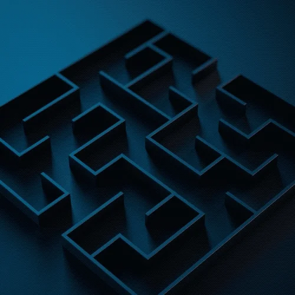
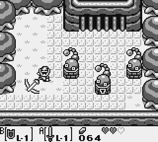

# Walls
Primary building block of most games are walls or barriers. They are the main game design element which gives the player a clear feedback about where they can or cant go.
The most typical scenario would be a maze game. Maze games have very clear functionality without the need to use any script. The two openings of the maze clearly define start and finish.

***Maze animation***\

Colliders also serve us a walking platform. Many platforming games fine tune their colliders meticulously to achieve the perfect platform for jumping, running, wall running etc.

Typical representations are:
## Grid
Grid structure can very easily create a clear path which is walkable.
It clearly presents it self to player and is very predictable. 
Because each block has the same size, it is very simple to design levels with grids.
The main disadvantage of grids is a very blocky character of the whole level.

***The Legend of Zelda: Link's Awakening***\

## Colliders
Physics engines use colliders to define certain volumes which are walkable platforms or un walkable walls. They are expressed as primitive geometric objects with certain volume.
Most common shapes are boxes, spheres, cylinders, capsules.

***The Last of Us***\
