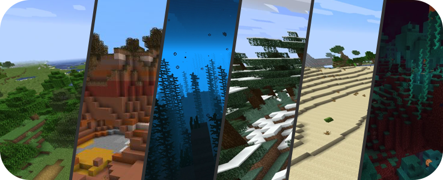
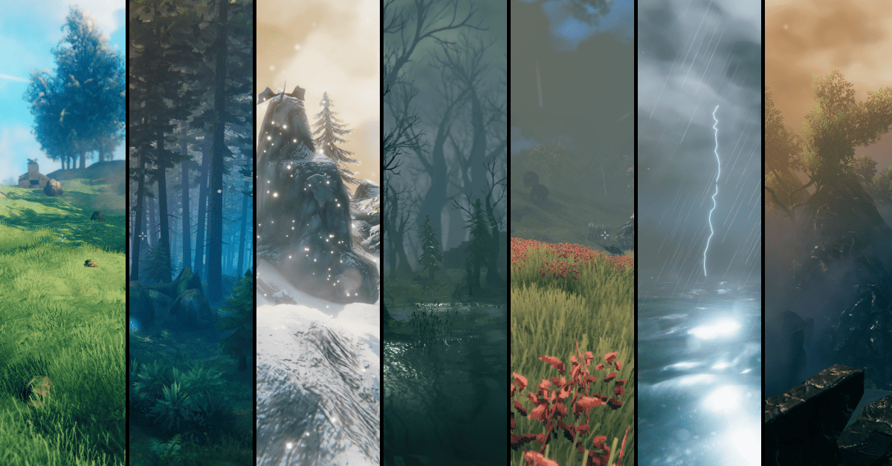
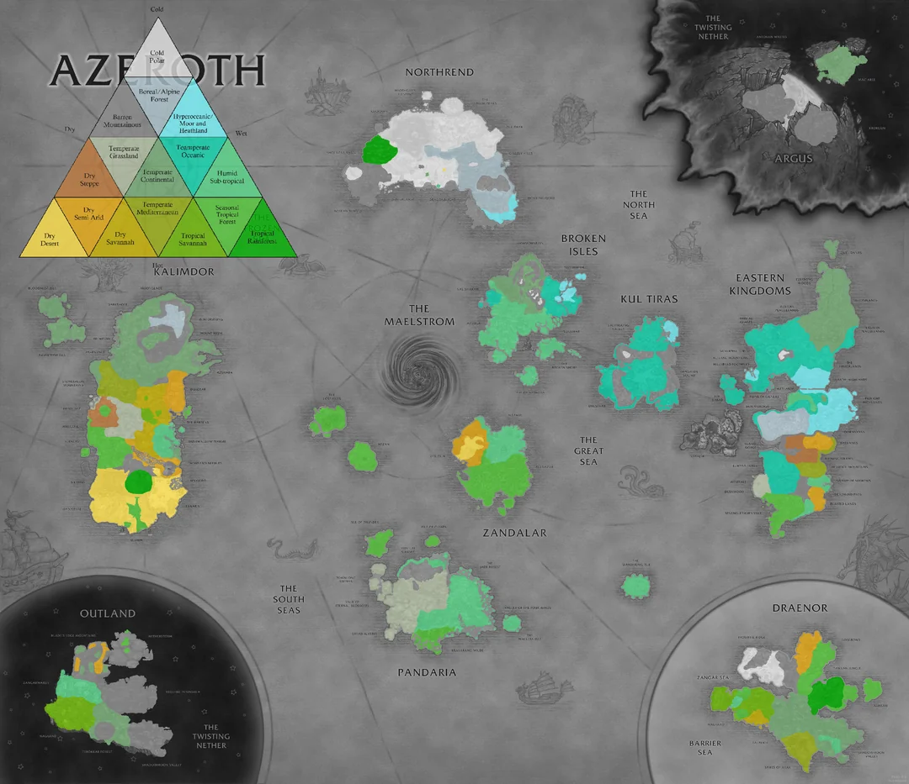
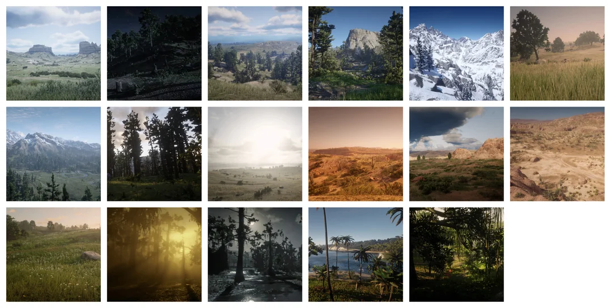
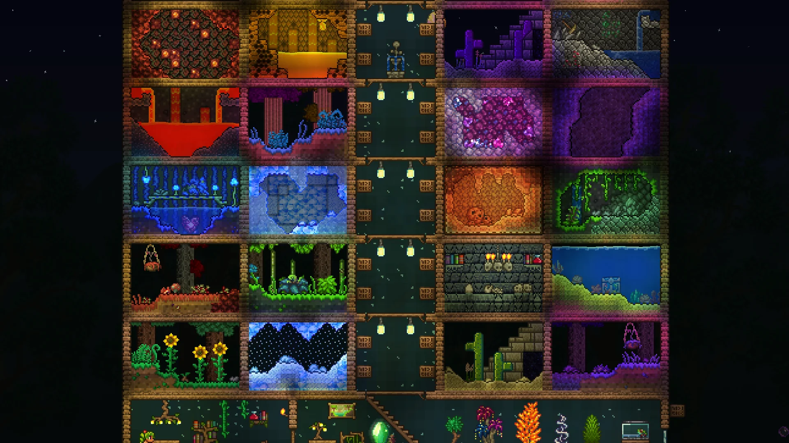
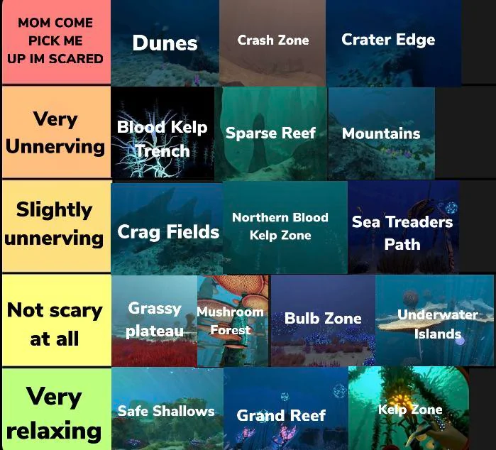

[World](world.md)

# World biomes

Many games which contain large worlds use biomes to differentiate
individual places. Biomes drastically change which creatures and plants
can live in such place. There is also clear indication of survival level,
biomes which have less water are usually much more difficult to survive in.

Famous games using biomes extensivelly.

***Minecraft***  

***Valheim***  

***World of Warcraft***  

***Red Dead Redemption 2***  

***Terraria biomes***  

***Subnautica biomes***  

- biomes    
    - Terrestrial
        - desert
        - grassland
        - forrest
        - rainforest
        - taiga
        - tundra
        - savanna
        - wetlands
        - mountains
    - Marine
        - coral reef
        - open sea
        - deep sea
        - polar