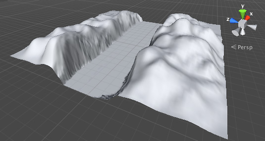
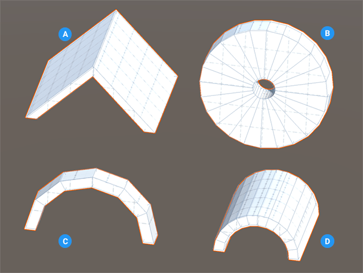
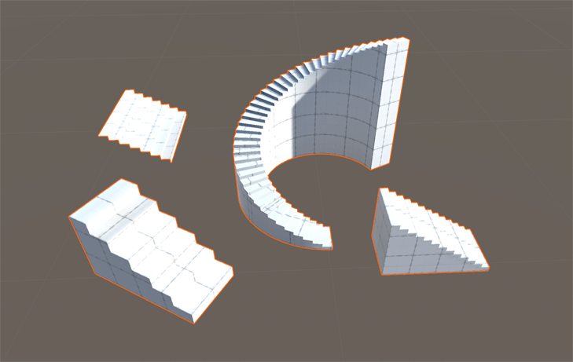

[World](world.md)

# World design

For designing our worlds we can use following tools:

### Terrain editor
[Unity Terrain Docs](https://docs.unity3d.com/Manual/script-Terrain.html)  
For creating our base terrain.

***Valleys and Hills***  

Scattering tools for adding trees, bushes, houses.

***Trees***  

### Probuilder
[Unity Probuilder Docs](https://docs.unity3d.com/Manual/com.unity.probuilder.html)  
It is polygonal modelling tool directly in Unity.
We can also use Blender and keep the source files in the Unity project
as unity can easily work with them directly.

***Arch***  

***Stairs***  

***Door***

