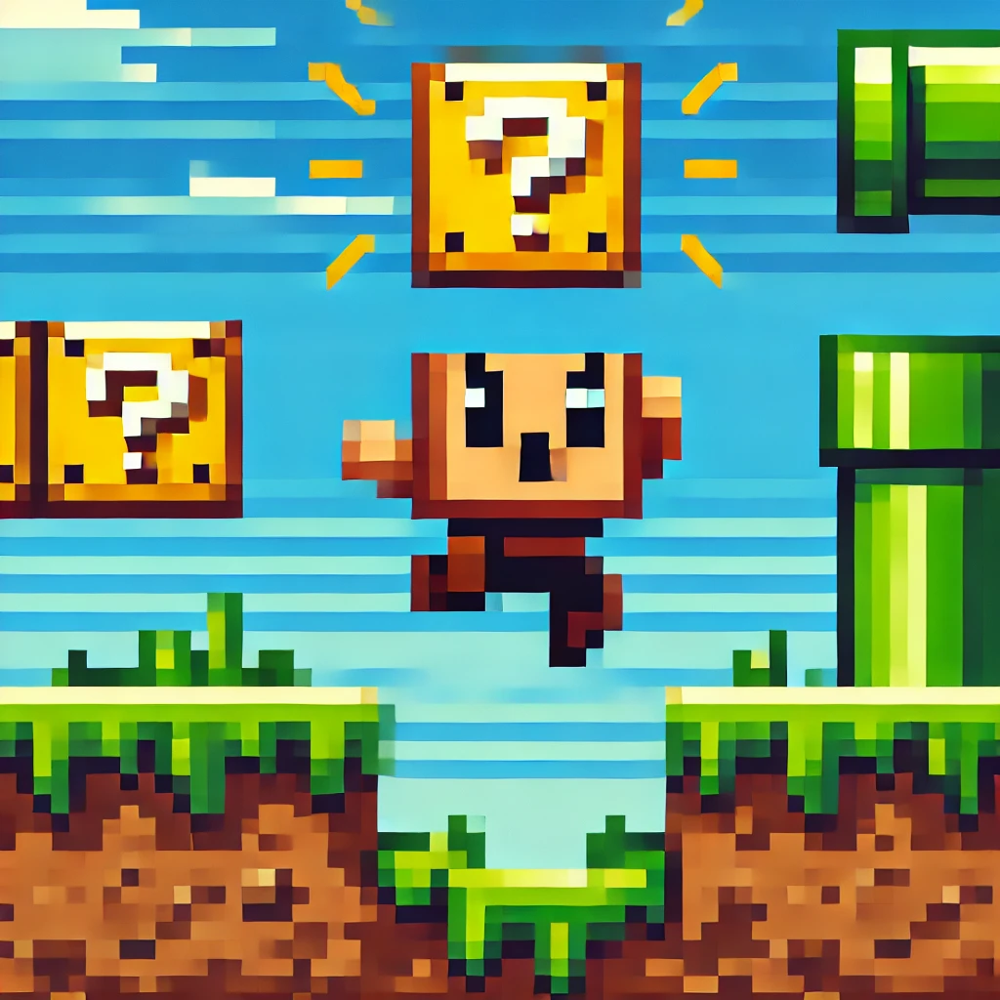
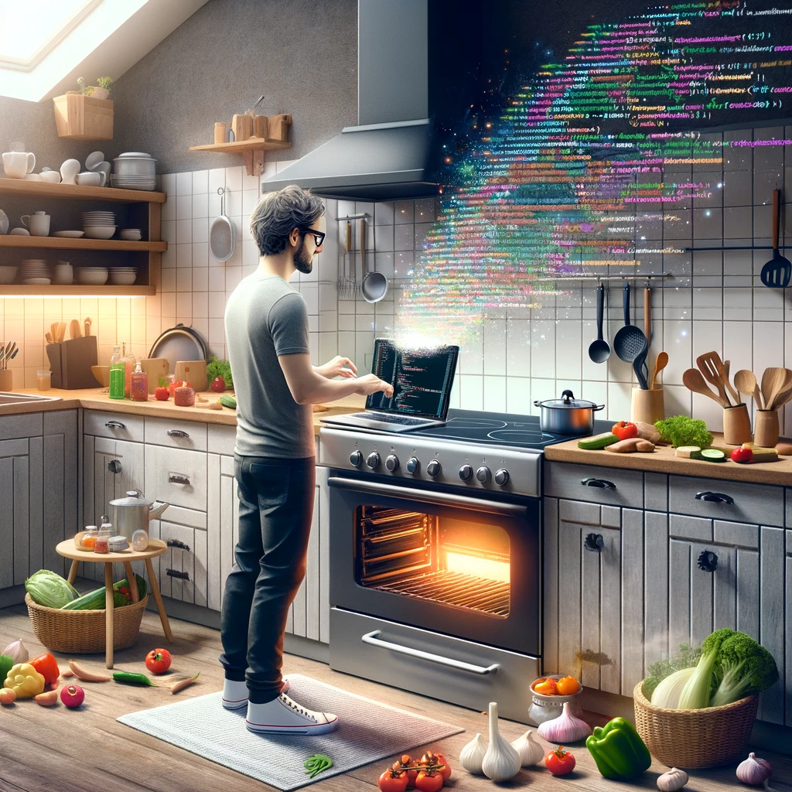

This GitHub repository is dedicated to explain the fundamentals   
of game development to absolute beginners, with no prior experience required.   
The game engine we are using is Unity, but the concepts them selves  
are compatible across any game engines.

# Installation

- [Unity package installation](Documentation~/installation/unity_upm_installation.md)

# Theory

This section is focusing on fundamental theory
related to game development.

- [Game Engines](Documentation~/game_dev/theory/game_engines.md)
- [Physics](Documentation~/game_dev/theory/physics.md)
- [Time](Documentation~/game_dev/theory/time.md)

# Building blocks

This section explains individual building blocks of most games.
Individual chapters describe specific topic from game design perspective,
they are sorted based on priority and also provide source code examples.

Each topic has a unity scene with examples.

- [Camera](Documentation~/game_dev/building_blocks/camera.md)
- [Character controller](Documentation~/game_dev/building_blocks/character_controller.md)
- [World](Documentation~/game_dev/building_blocks/world.md)
- [Console](Documentation~/game_dev/building_blocks/console.md)
- [Triggers](Documentation~/game_dev/building_blocks/triggers.md)
- [Teleports](Documentation~/game_dev/building_blocks/teleports.md)
- [Timers](Documentation~/game_dev/building_blocks/timers.md)
- [Spawners](Documentation~/game_dev/building_blocks/spawners.md)
- [Counters](Documentation~/game_dev/building_blocks/counters.md)
- [Quests](Documentation~/game_dev/building_blocks/quests.md)
- [Inventory](Documentation~/game_dev/building_blocks/inventory.md)
- [Map](Documentation~/game_dev/building_blocks/map.md)
- [Chance](Documentation~/game_dev/building_blocks/chance.md)

# Programming

This section is about basics of programming syntax, data types and functions.
It is meant to explain very basic programming topics using the c# programming language.

[Programming vs Cooking](Documentation~/csharp/programming_vs_cooking.md)

Most basic programming topics:

- [Constants](Documentation~/csharp/constants.md)
- [Variables](Documentation~/csharp/variables.md)
- [Types](Documentation~/csharp/types.md)
- [Scope](Documentation~/csharp/scope.md)
- [Functions](Documentation~/csharp/functions.md)
- [Operators](Documentation~/csharp/operators.md)
- [Conditions](Documentation~/csharp/conditions.md)
- [Loops](Documentation~/csharp/loops.md)

Work in progress :)