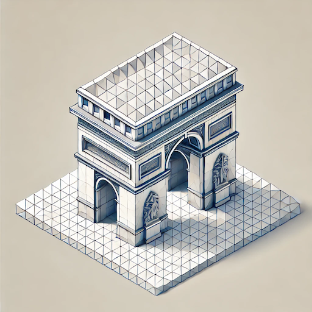
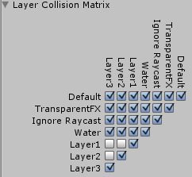

[Main page](../../../readme.md)

# Physics

The purpose of a physics library is to make interactions with the game world simpler.  
Every physics library does essentially the same thing, just in a different way resulting in different performance and stability.  
The main features of physics engines are:

## Colliders
Barriers which prevent the player from freely moving around.

### Primitive colliders

Primitive geometrical shapes represented by a simple math equation.  
They are considered water tight and represent a physical volume inside the world.  
If rigid body tries to penetrate a primitive collider it will be pushed outside of the collider volume. Primitives are cheap to calculate.  
When combined primitive shapes can recreate any complex shape.  

- Box
- sphere
- capsule

### composite colliders  

Composite shapes are usually made of triangles. They are very convenient as they are automatically generated from our 3D meshes, however whenever there is a single error in our mesh, vertices, edges not connected or a wrong face orientation the collision can be easily penetrable. Triangles do not form water tight solids, therefore it is possible to penetrate them 
because they represent just a thin wall with single direction of penetration. They are very often the cause of holes inside games.

- Convex shapes
- Concave shapes

## Collision interactions

- Colliders are static barriers and we should not move them during gameplay.
- Rigid bodies are meant to be moved in the game and interact with colliders.
- Ridid bodies have to use layer mask in order to tell which colliders they should interact with.

### Collision Matrix

Unity uses a [layer based collision detection](https://docs.unity3d.com/Manual/LayerBasedCollision.html)
That means, all rigid bodies and colliders need specify its layer and the collision matrix explains, which layers interact with which layers.

## Collider detection

We often want to detect if a player has hit an enemy.  
In that case we want to cast a ray in to the game world and detect if the ray intersects with any enemy or a wall.
- ray casting

When our projectile is larger than a beam of laser or a small bullet we want the projectile to deflect or stop even when its side just touches a wall.

- sphere casting
- capsule casting
- box casting

Sometimes we want to just find all colliders overlapping a certain area.
- primitive shape overlap

When a player hits an enemy we often want to calculate the amount of damage dealt, we can use contact point detection for that.
- Contact point detection

### Triggers

When a player walks in to certain area we want to play sound or cinematic cutscene for that we use triggers.

#### Rigid bodies

- Non-kinematic rigidbodies are for simulating objects which are being pushed around by other colliders, rigidbodies or forces like gravity or wind.  
They are driven only by the physics engine.  
- Kinematic rigidbodies are for animation driven collisions.  
They are not moving by the physics engine but by the animation.  
This very often leads to issues as the wall it self cannot be stopped by the physics engine, but everything else is being affected by the wall.  
This can often lead to unwanted collisions and object penetration.  

[Unity Physics API](https://docs.unity3d.com/ScriptReference/Physics.html)

### List of popular physics engine libraries

[Nvidia PhysX](https://github.com/NVIDIA-Omniverse/PhysX)  
[Bullet](https://github.com/bulletphysics/bullet3)  
[Box2D](https://box2d.org/)  
[Havok](https://www.havok.com/)  

Unreal engine has custom physics library  
[Chaos](https://dev.epicgames.com/documentation/en-us/unreal-engine/chaos-physics-overview?application_version=4.27)  

